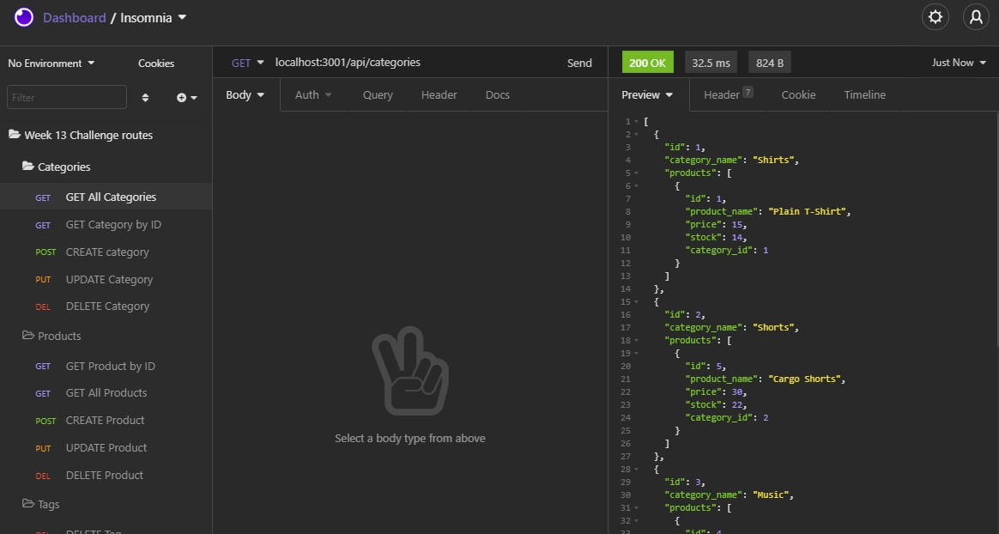
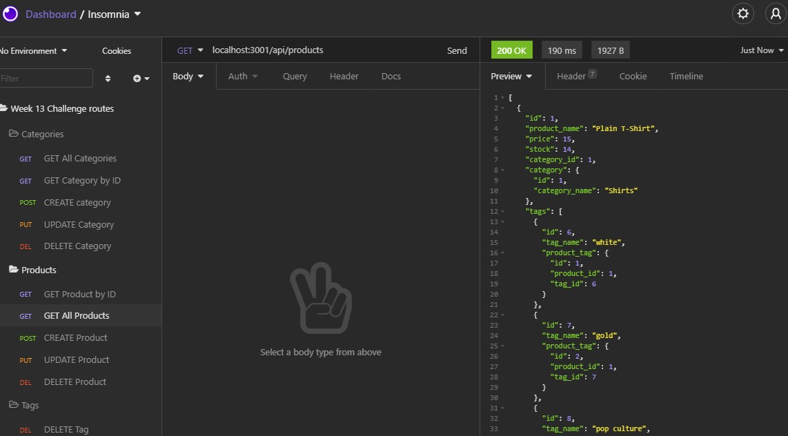
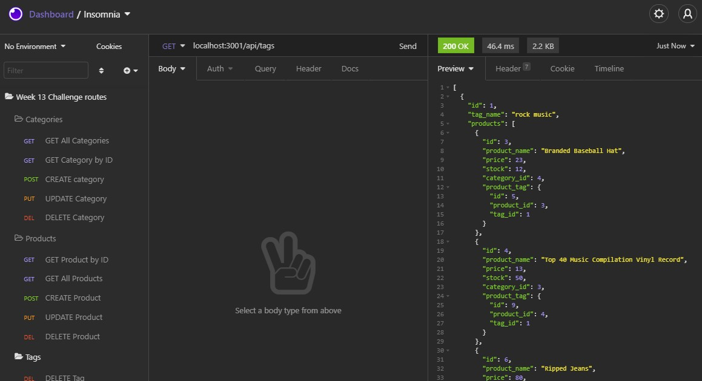

# eCommerce Back End

## Description
This is a basic back end setup for a retail company. It is setup using NodeJS, Express.js, MySQL and the Sequelize ORM. The database has tables for Categories, Products, Tags and Product Tags.

The setup has REST API routes for each table that allow you to:

* View All categories and associated products
* View a single Category by its id# and its associated products
* Create a new category
* Update a category name
* Delete a category
* View All Products with their associated category and tag info
* View a single product by its id# and its associated category and tag info
* Create a new product
* Update a product
* Delete a product
* View all tags and associated products
* View a single tag by id# and associated products
* Create a new tag
* Update a tag
* Delete a tag

## Table of Contents
* [Installation](#Installation)
* [Usage](#Usage)
* [Technologies](#Technologies)
* [Preview](#Preview)

## Installation
Use `npm i` to install the needed dependencies after copying the repository. 

## Usage
Log in to mySQL and run `source db/schema.sql` to create database

Database can be synced and seeded using the command `npm run seed`

Server can be run from the command line using `npm start`

## Technologies
This application was made using

 
with the express.js, mysql2, dotenv and Sequelize npm packages 

## Preview
### Screenshots

### Demo Video
https://drive.google.com/file/d/1nijctGEB22Qh-FrqycTLOAURsT2PDqrV/view